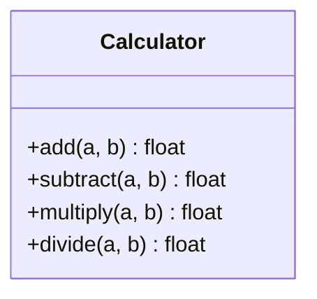

# Class Diagram — calculator.py

> Auto-updated to reflect the current state of `src/calculator.py`.
> Last updated: 2026-04-03

## Method descriptions

| Method | Parameters | Returns | Notes |
|--------|-----------|---------|-------|
| `add` | `a`, `b` | `a + b` | |
| `subtract` | `a`, `b` | `a - b` | |
| `multiply` | `a`, `b` | `a * b` | |
| `divide` | `a`, `b` | `a / b` | Raises `ValueError` if `b == 0` |
